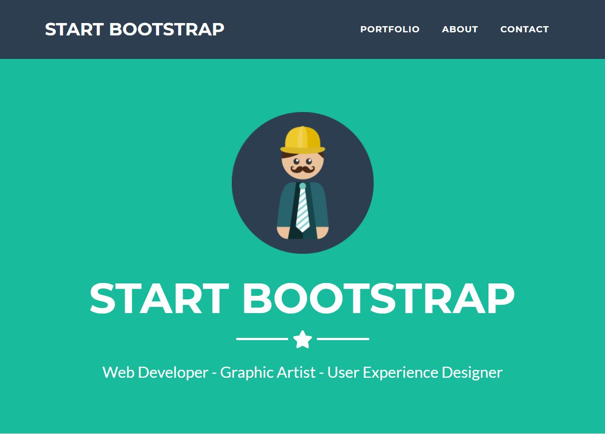

# PHP: Bootstrap!

## Inhoud
 - [Introductie](#Introductie)
 - [Voor- vs Nadelen](#voor-vs-nadelen)
 - [Hoe moet ik het toepassen?](#Hoe-moet-ik-het-toepassen)
 - [Documentatie](#Documentatie)
 - [Opdrachten](#Opdrachten) 


## Introductie
Twitter bootstrap is een intuïtief en krachtig framework om snel moderne websites en webapplicaties te ontwikkelen. In dit artikel een uitleg van Bootstrap en 10 redenen waarom je het in zou kunnen zetten voor je volgende web project. Het belangrijkste voordeel van Bootstrap is dat het enorm veel tijd bespaart en daarmee de ontwikkelingskosten drukt.

### Wat is het?
Twitter bootstrap is een gratis verzameling van tools voor het bouwen van websites en webapplicaties. Het bevat HTML en CSS gebaseerde design templates voor fonts, formulieren, buttons, grafieken, navigatie en andere interface componenten alsmede optionele javascript extensies. 

De basis werd oorspronkelijk gelegd door Twitter ontwikkelaars Mark Otto en Jacob Thorton, maar kent inmiddels ook zeer veel toepassingen buiten het social media platform. In 2011 werd het beschikbaar gesteld als open source project en sindsdien is het de favoriet van veel web ontwikkelaars geworden. 

## Voor- vs Nadelen

### Voordelen van Bootstrap
1. Snel \
Bootstrap werkt optimaal wanneer je weinig tijd hebt om een website of een app te bouwen. Je hoeft slechts een template te kiezen. Vervolgens pas je deze aan en je bent klaar.

2. Eenvoudig \
Wie HTML en CSS kent, kan zo met Bootstrap aan de slag. Bovendien is je website of app meteen inzetbaar voor mobiel gebruik.

3. Geschikt voor mobiel \
Bootstrap maakt gebruik van een grid lay-out. Dat is de reden waarom het framework ervoor zorgt dat websites en applicaties meteen responsief zijn.

4. Open source \
De broncode van Bootstrap is gratis beschikbaar. Je bent zelf vrij om het framework aan te passen.

5. Geschikt voor verschillende browsers \
Bootstrap is compatibel met verschillende browsers en kan dan ook gebruikt worden met Google Chrome, Firefox, Internet Explorer, Opera en Safari.

### Nadelen van Bootstrap
1. Alles ziet er standaard uit. \
Dit komt omdat Bootstrap eenvoudig is om te gebruiken en daarom weinig wordt aangepast. Vele websites en applicaties zien er daarom hetzelfde uit. Een aantal ontwikkelaars neemt de moeite niet om aanpassingen te doen om tot een uniek resultaat te komen. Het framework biedt echter wel de mogelijkheid om de elementen te finetunen waardoor een unieke look wel tot de mogelijkheden behoort.

2. De laadtijd \
Bootstrap is een zwaar framework. Dit heeft zo zijn gevolgen voor de laadtijd van een applicatie of site. Sommige ontwikkelaars werken dan ook liever met een ander framework.


## Hoe moet ik het toepassen?

Om te beginnen raad ik aan om gebruik te maken van een starters template die bootstrap voor ons voorziet via hun [website](https://getbootstrap.com/docs/4.2/getting-started/introduction/#starter-template)

```html
<!doctype html>
<html lang="en">
  <head>
    <!-- Required meta tags -->
    <meta charset="utf-8">
    <meta name="viewport" content="width=device-width, initial-scale=1, shrink-to-fit=no">

    <!-- Bootstrap CSS -->
    <link rel="stylesheet" href="https://stackpath.bootstrapcdn.com/bootstrap/4.2.1/css/bootstrap.min.css" integrity="sha384-GJzZqFGwb1QTTN6wy59ffF1BuGJpLSa9DkKMp0DgiMDm4iYMj70gZWKYbI706tWS" crossorigin="anonymous">

    <title>Hello, world!</title>
  </head>
  <body>
    <h1>Hello, world!</h1>

    <!-- Optional JavaScript -->
    <!-- jQuery first, then Popper.js, then Bootstrap JS -->
    <script src="https://code.jquery.com/jquery-3.3.1.slim.min.js" integrity="sha384-q8i/X+965DzO0rT7abK41JStQIAqVgRVzpbzo5smXKp4YfRvH+8abtTE1Pi6jizo" crossorigin="anonymous"></script>
    <script src="https://cdnjs.cloudflare.com/ajax/libs/popper.js/1.14.6/umd/popper.min.js" integrity="sha384-wHAiFfRlMFy6i5SRaxvfOCifBUQy1xHdJ/yoi7FRNXMRBu5WHdZYu1hA6ZOblgut" crossorigin="anonymous"></script>
    <script src="https://stackpath.bootstrapcdn.com/bootstrap/4.2.1/js/bootstrap.min.js" integrity="sha384-B0UglyR+jN6CkvvICOB2joaf5I4l3gm9GU6Hc1og6Ls7i6U/mkkaduKaBhlAXv9k" crossorigin="anonymous"></script>
  </body>
</html>
```

In deze template word er gebruikt gemaakt van een [CDN](https://www.globaldots.com/content-delivery-network-explained/) waardoor we jQuery en bootstrap niet hoeven te downloaden naar onze lokale computer tijdens het developen.

Bootstrap bestaat uit kleine voorgemaakte componenten die we kunnen toepassen in onze pagina om zo de snelheid van het developen te verhogen en niet al te veel tijd bezig te moeten zijn met de opmaak van onze pagina.

Door classes aan onze HTML elementen te voorzien zoals ze worden uitgelegd in de documentatie in de link hieronder, krijgen we de mogelijkheid om deze voorgemaakte styling in onze pagina aan te brengen.

Hou er rekening mee dat het wel belangrijk is dat je de zelfde HTML structuur moet worden aangehouden als word aangegeven in de voorbeelden.


## Documentatie
Neem de volgende pagina`s door:
 - [Bootstrap Getting Started](https://getbootstrap.com/docs/4.2/getting-started/introduction/)
 - [Bootstrap Grid Explained](https://uxplanet.org/how-the-bootstrap-4-grid-works-a1b04703a3b7)

## Opdrachten

Om uw vaardigheden met boostrap te versterken, de volgende opdrachtjes.
Maak de volgende pagina`s na, zonder de HTML of broncode te inspecteren:

 - Opdracht 1 \
 Maak een grid met 3 blokken waarvan elke blok op mobile 12 kolomen groot is, op tablet 6 kolomen groot is en op een desktop 4 kolomen groot is.
 Je mag alleen maar gebruik maken van bootstrap en geen eigen CSS file aanmaken. \
 [Voorbeeld](https://codepen.io/ministrare/full/pqqJbQ)

 - Opdracht 2 \
 Maak de volgende afbeelding na. Je mag alleen maar gebruik maken van bootstrap en geen eigen CSS file aanmaken.
  

 - Opdracht 3 \
 Maak de volgende pagina na. Je mag alleen maar gebruik maken van bootstrap en probeer het zonder af te kijken in de broncode. \
 [Voorbeeld](https://getbootstrap.com/docs/4.2/examples/jumbotron/)