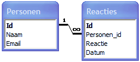
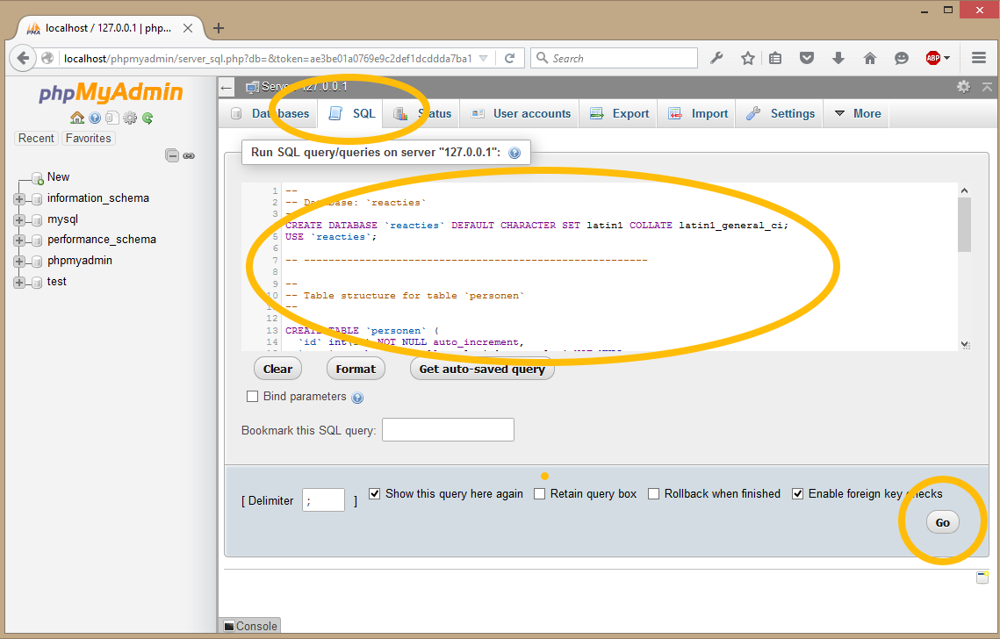

# Beheren van een database

## Inhoudsopgave
- [Voorbereiding](#voorbereiding)
- [Introductie](#introductie)
- [Database types](#Database-types)
- [Wat zijn ‘relationele’ databases](#Wat-zijn-relationele-databases)
  - [Veelgebruikte relationele databases zijn](#Veel-gebruikte-relationele-databases-zijn)
- [MySQL](#MySQL)
- [PHPMyAdmin](#PHPMyAdmin)
- [Een database](#Een-database)

## Voorbereiding

[Download](./voorbeeld-database.sql) de volgende SQL export om deze tijdens deze opdracht te importeren. De instructies worden gegeven.

## introductie

Als we data willen opslaan (bijvoorbeeld uit webformulieren) dan kunnen we dat in tekstbestanden doen. En dat gaat goed zolang het niet teveel data is en zolang we geen ingewikkelde bewerkingen of zoektochten door deze data ondernemen. Zodra we dat wél willen doen wordt het slim een database systeem te gebruiken.

Databases (ook wel: databanken of gegevensbanken) zijn programma's die gemaakt zijn om informatie mee op te slaan en te beheren. Je kunt je een database voorstellen als een virtuele archiefkast… Maar dan met wat extra toeters en bellen.

## Database types:
Er worden verschillende soorten databases gebruikt vandaag de dag. De meest gangbare zijn:

1. Relationele databases.
1. Object databases.
1. Flat file databases.

Je kunt je elk type database voorstellen als een verschillende manier (in concept en in de praktijk) om informatie te bewaren en te beheren.

Elk type database heeft z’n voor- en nadelen. Dat gezegd zijnde, de meest populaire database bij uitstek is de ‘relationele database’. Daarom gaan we deze nu hier bespreken.

## Wat zijn ‘relationele’ databases?

Zoals eerder vermeld, heeft elk type database een verschillende manier om informatie op te slaan en te beheren.

Een relationele database beheert haar data (informatie) door relaties te maken tussen de verschillende stukken informatie (opgeslagen in virtuele containers) die een verband met elkaar hebben.

Anders gezegd: als je een broer zou hebben, dan is je moeder de ‘sleutel’ die het verband is (de relatie) tussen jou en je broer.

Met dit beeld in gedachten, kunnen we zeggen dat een relationele database de informatie opslaat en beheert door ‘sleutels’ te gebruiken (in dit geval je moeder) die twee stukken informatie gemeen hebben - jullie hebben allebei dezelfde moeder.

### Veelgebruikte relationele databases zijn:

- MySQL (veel gebruikt in combinatie met PHP omdat het gratis is)
- Oracle
- Microsoft SQL Server

## MySQL

MySQL is zo'n database systeem, we gebruiken dit systeem omdat:

- het open source (en dus gratis) is
- het ondanks dat het gratis is, een zeer uitgebreide en stabiele database server is
- het de meeste gebruikte database in combinatie met PHP is
- al geïnstalleerd staat op uw computer vanaf het moment dat wij WAMP geïnstalleerd hadden.

Genoeg redenen dus, maar het is ook mogelijke andere database-systemen als Microsoft Access, Postgress of SQL server te gebruiken.

## PhpMyAdmin

Een database is een systeem dat zorg draagt voor het opslaan, bewerken en bevragen van data. En dat is eigenlijk ook alles wat het is. Er is niets aan te zien. Als u Microsoft Access wel eens geopend heeft, dan weet u dat daar wel wat te zien is (tabellen, queries, formulieren, etc). Al wordt dit vaak de database genoemd, het is in feite een DBMS (DataBase Management System) dat u ziet. Een DBMS is de interface voor een gebruiker naar de achterliggende database. Voor MySQL hebben we ook zo'n interface nodig, er zijn er meerdere, maar wederom kiezen we voor de meest gebruikte en meest gebruikersvriendelijke variant die wederom al op uw computer is geïnstalleerd als u XAMP heeft geïnstalleerd. Dit DBMS heet PhpMyAdmin.

PhpMyAdmin is te vinden, als het geïnstalleerd staat, op http://localhost/phpmyadmin/. In dit geval is het DBMS niet beveiligd (u hoeft niet in te loggen), omdat we alleen op de eigen computer werken. In PhpMyAdmin kunnen we de databases bewerken. We kunnen nieuwe databases aanmaken, tabellen toevoegen, tabellen veranderen, verwijderen, de databases bevragen en nog meer. Voor meer informatie kunt u de [website van het PhpMyAdmin Project](http://www.phpmyadmin.net/) bekijken.

## Een database



Opmerking: de bovenstaande afbeelding is met MS Acces gemaakt omdat PhpMyAdmin niet een dergelijke weergave heeft. Het is slechts bedoeld als illustratie!

Wat we zien is een database (het geheel) die reacties heet. Twee zogenaamde tabellen die personen en reacties heten. Beide tabellen hebben op hun beurt weer zogenaamde attributen. Verder is er een één-op-veel relatie tussen personen en reacties hetgeen zoveel wil zeggen dat één persoon meerdere reacties kan maken. Een ander belangrijk aspect is dat beide tabellen een attribuut Id hebben. Dit zorgt ervoor dat een record dat uiteindelijk in de tabel komt te staan uniek te identificeren is (het is mogelijk dat een persoon twee keer hetzelfde berichtje stuurt, deze willen we wel uit elkaar kunnen houden).

U kunt proberen zelf bovenstaande database aan te maken met behulp van PhpMyAdmin. Surf naar http://localhost/phpmyadmin/ en klik links op het knopje SQL (sql). Er verschijnt dan een zogenaamd query window alwaar u de SQL query kunt uitvoeren. Druk vervolgens op Go (of start afhankelijk van uw versie) om er voor te zorgen dat de query wordt uitgevoerd!




Om een bepaalde database te selecteren om met u te werken, geeft u de USE-instructie als volgt uit:

``USE database_name;``

We weten allemaal dat het veel gemakkelijker is om thuis je spullen op te bergen in dozen en die vervolgens te labelen dan om al je troep op de vloer te laten slingeren.

Alhoewel ze van nature chaotisch zijn, waren computernerds zich hier van bewust en beseften dat computer informatie ook in gelabelde dozen (virtuele containers) moet worden opgeslagen. In een relationele databases noemen we deze ‘dozen’ tabellen

In een notendop: de virtuele containers heten ‘tabellen’ en hier wordt de informatie in opgeslagen.

## Een tabel

Tabellen in een database zijn virtuele containers om informatie in op te slaan en te organizeren. Ze lijken in vele opzichten wel op spreadsheets, aangezien database tabellen ook bestaan uit kolommen en rijen.

Het verschil tussen een spreadsheet (zoals Excel) en een relationele database, is dat een spreadsheet is gemaakt (en mogelijkheden heeft) om gegevens te bewerken om ze te presenteren - zoals diagrammen en rapportages e.d.

Aan de andere kant is een database tabel gemaakt (en heeft gereedschappen en mogelijkheden) om gegevens te organiseren en op te slaan. Het kan dan ook veel meer data opslaan dan een spreadsheet.

Dus, ja, je kunt ook informatie opslaan in een spreadsheet, maar het heeft niet de mogelijkheden die je in een database vindt.

## Voorbeeld database importeren

 - Maak een database aan genaamd ``voorbeeld-database``.
 - Selecteer het tabblad, ``importeren``.
 - Selecteer uw bestand via de button, bestand kiezen.
 - en druk vervolgens op starten.
 
## Datatypes
MySQL kan werken met verschillende types van data. Dit loopt van een string tot bijvoorbeeld een boolean waarde. Er zijn verschillende data types binnen MySQL, het is belangrijk om de juiste datatypes te gebruiken voor het bevorderen van de snelheid en het minimaliseren van fouten, dus een waarde die niet hoger wordt dan 255 behoeft niet als een eengrote integer opgeslagen te worden.

Je hebt bijvoorbeeld ook SIGNED en UNSIGNED datatypen, een SIGNED datatype kan ook negatief zijn, hiervoor moet 1 bitje ingeleverd worden (laatste (meest linkse) bit: 0=negatief 1=positief) , vandaar de helft van de maximale waarde.

- [BIT](http://www.mysqltutorial.org/mysql-bit/)
- [BOOLEAN](http://www.mysqltutorial.org/mysql-boolean/)
- [CHAR](http://www.mysqltutorial.org/mysql-char-data-type/)
- [DATE](http://www.mysqltutorial.org/mysql-date/)
- [DATETIME](http://www.mysqltutorial.org/mysql-datetime/)
- [DECIMAL](http://www.mysqltutorial.org/mysql-decimal/)
- [ENUM](http://www.mysqltutorial.org/mysql-enum/)
- [INT](http://www.mysqltutorial.org/mysql-int/)
- [JSON](http://www.mysqltutorial.org/mysql-json/)
- [TIME](http://www.mysqltutorial.org/mysql-time/)
- [TIMESTAMP](http://www.mysqltutorial.org/mysql-timestamp.aspx)
- [VARCHAR](http://www.mysqltutorial.org/mysql-varchar/)

- [Volledige overzicht](http://domoticx.com/mysql-database-datatypen/)

## SQL

Met behulp van deze instructie kunnen gegevens in tabellen worden opgevraagd (of geselecteerd) en opnieuw worden voorgesteld als een zogenoemde tijdelijk nieuwe tabel. 

Dit commando is onomstotelijk het belangrijkste element van een sql-statement of query waarbij gegevens worden opgevraagd. Dit is anders gezegd het zogeheten fundament of basisbeginsel van een sql-statement dat informatie opvraagt. 

Syntax:
```
SELECT kolomnaamı (, kolomnaam2, ...) FROM tabelnaam; 
```sql

Deze syntax bevat twee belangrijke onderdelen of bouwstenen, namelijk select en from. Na het select-commando kunnen één, meerdere of alle kolomnamen worden geplaatst die voorkomen in de tabel die is opgenomen na de from-clausule. 

De verschillende kolomnamen die opgesomd worden na het select-commando, die nen echter wel gescheiden te worden door een komma. 

Het is eveneens mogelijk om, zonder opgave van alle kolomnamen, alles van een bepaalde tabel te selecteren door enkel een asterix achter het select-commando te plaatsen. Dus 'SELECT * FROM tabelnaam'. 


### Opdracht

- Selecteer uit de tabel personen de naam van alle personen. 
- Selecteer uit de tabel personen de naam en voornaam van alle personen. 